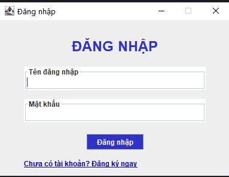
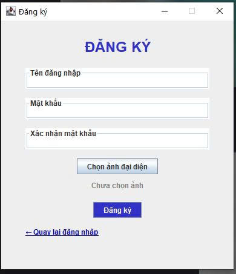
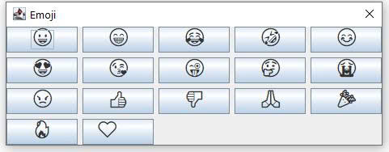
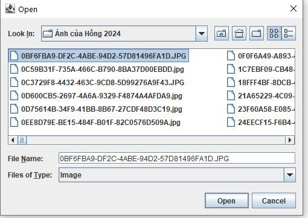
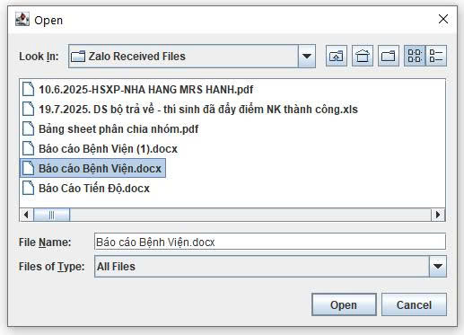
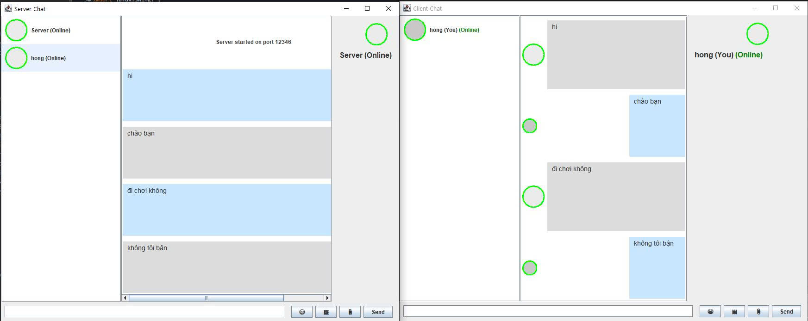

<h2 align="center">
    <a href="https://dainam.edu.vn/vi/khoa-cong-nghe-thong-tin">
    🎓 Faculty of Information Technology (DaiNam University)
    </a>
</h2>
<h2 align="center">
    Client-Server chat application using TCP
</h2>

    

        
        
        
    

---

    <h2>Đề tài: Ứng dụng chat Client-Server sử dụng TCP</h2>
    
 <h3>1.Giới thiệu hệ thống</h3>
    

        Đây là hệ thống chat theo thời gian thực, cho phép đăng ký, đăng nhập, gửi tin nhắn văn bản, hình ảnh, file và nhãn dán giữa các user. Hệ thống cũng hiển thị trạng thái online/offline của người dùng, giúp việc trao đổi thông tin trở nên thuận tiện.
    

    
 
Các chức năng chính:

    <ul style="font-size: 16px; line-height: 1.6;">
        <li>Đăng ký và đăng nhập tài khoản người dùng</li>
        <li>Gửi/nhận tin nhắn văn bản giữa nhiều người dùng</li>
        <li>Gửi/nhận hình ảnh, file và nhãn dán (emoji/sticker)</li>
        <li>Hiển thị danh sách người dùng online/offline</li>
        <li>Thông báo khi người dùng đang gõ tin nhắn (typing indicator)</li>
        <li>Chat riêng lẻ hoặc chat nhóm (broadcast)</li>
    </ul>

  

  Ngôn ngữ lập trình: Java  
   - Giao thức mạng: TCP (Socket programming)  
   - Giao diện người dùng: Swing (Java GUI)  
   - Xử lý dữ liệu: ObjectInputStream/ObjectOutputStream  
   - Một số thư viện hỗ trợ: javax.swing, java.net, java.io, java.util.concurrent
    

## 2.Ngôn ngữ & Công nghệ chính

    
 Ngôn ngữ lập trình: Java
  - Giao thức mạng: TCP (Socket programming)
  - Giao diện người dùng: Swing (Java GUI)
  - Xử lý dữ liệu: ObjectInputStream/ObjectOutputStream
  - Một số thư viện hỗ trợ: javax.swing, java.net, java.io, java.util.concurrent

## 3. Hình ảnh các chức năng

    

         
        <i>Hình 1: Chức năng đăng nhập<i>  
         
         <i>Hình 2: Chức năng đăng ký<i>  
         
        <i>Hình 3: Chức năng gửi sticker<i>  
          
        <i>Hình 4: Chức năng gửi ảnh <i>  
          
         <i>Hình 5: Chức năng gửi file<i>  
          
         <i>Hình 5: Hình ảnh Server và Client đang chat <i>  
    

##  📝 4. Hướng dẫn cài đặt và sử dụng ứng dụng 
**🔧Yêu cầu hệ thống**
- **Java Development Kit (JDK)**: Phiên bản 8 trở lên
- **Hệ điều hành**: Windows, macOS, hoặc Linux
- **Môi trường phát triển**: IDE (IntelliJ IDEA, Eclipse, VS Code) hoặc terminal/command prompt
- **Bộ nhớ RAM**: Tối thiểu 512 MB (khuyến nghị ≥ 2 GB)
- **Dung lượng**: Khoảng 10MB cho mã nguồn và file thực thi
- **Port**: 12346

 **📦 Cài đặt và triển khai** 
 Bước 1: Chuẩn bị môi trường 
- **Java Development Kit (JDK)**: Phiên bản 8 trở lên
- **Hệ điều hành**: Windows / macOS / Linux
- **Môi trường phát triển**: IDE (IntelliJ IDEA, Eclipse, NetBeans, VS Code) hoặc Terminal/Command Prompt
  
 Bước 2: Khởi động chương trình 
- **Bước 1**: Chạy Server trước (server sẽ lắng nghe các kết nối).
- **Bước 2**: Chạy Client (có thể mở nhiều client để nhiều người dùng chat với nhau).

 Bước 3: Đăng ký tài khoản (lần đầu) 
- Nhấn nút Register trên giao diện client.
- Nhập thông tin:
        + Username (tên tài khoản, duy nhất)
        + Password (mật khẩu)
- (Tùy chọn) Chọn avatar để hiển thị.
- Nhấn Xác nhận / Đăng ký → Nếu thành công sẽ hiện thông báo "Đăng ký thành công".

 Bước 4: Đăng nhập  
-  Nhập Username và Password đã đăng ký.
-  Nhấn Login → nếu đúng, hệ thống sẽ đưa bạn vào cửa sổ chat chính.

 Bước 5: Giao diện chat chính  
- Danh sách người dùng: hiển thị tất cả tài khoản (online / offline).
- Khu vực chat: nơi hiển thị tin nhắn gửi và nhận.
- Khung nhập: nơi nhập nội dung tin nhắn.

 Bước 6: Các nút chức năng  
- Gửi tin nhắn văn bản.
- Gửi hình ảnh.
- Gửi file.
- Gửi emoji / sticker.
---
## 5.Phương thức liên hệ
- Họ và tên: Nguyễn Thu Hồng
- Email: nguyenhongnunu@gmail.com
- © 2025 AIoTLab, Faculty of Information Technology, DaiNam University. All rights reserved.
---
